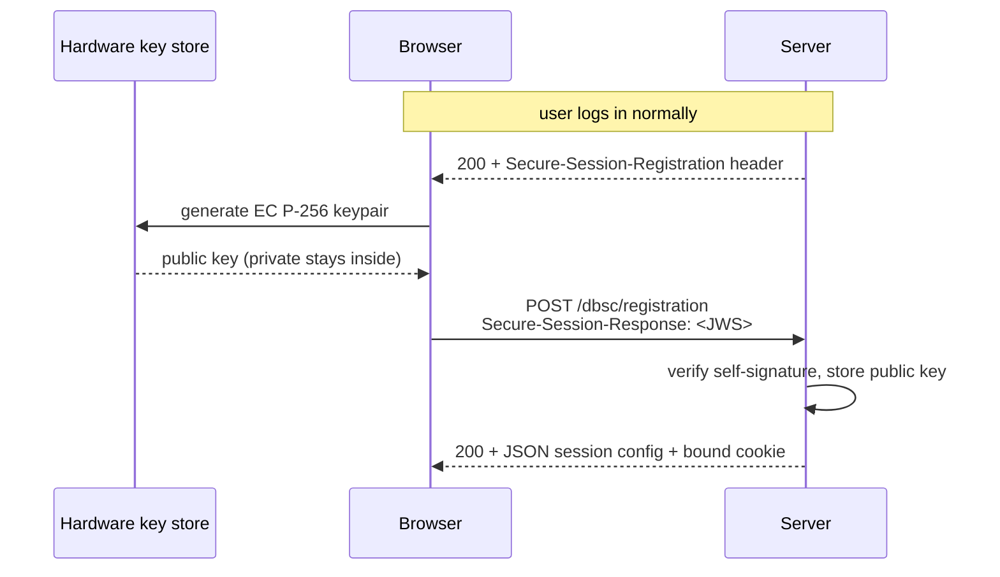
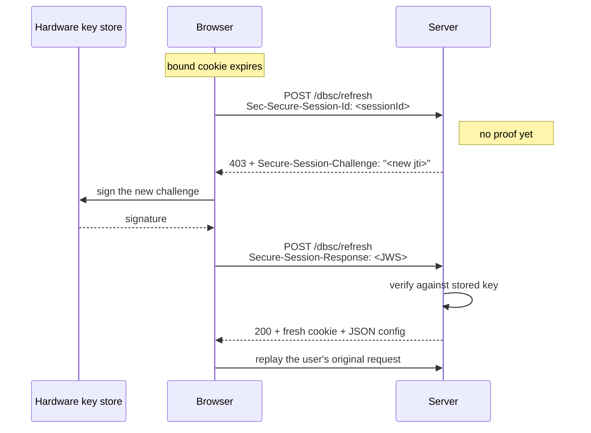

A session cookie is a bearer token. Whoever holds it is the user — the server has no way to tell the real browser apart from a copy of the cookie pasted into a different one. That single property is behind a huge share of real-world account takeovers: infostealer malware lifts cookies out of the browser profile, ships them to an attacker, and the attacker is logged in as you without ever touching your password or your MFA.

Device Bound Session Credentials (DBSC) is the W3C protocol that removes the "whoever holds it" part. Chrome shipped it to stable in version 146. This post walks the entire protocol end to end with no framework and no specific language — just what travels on the wire and why each piece is shaped the way it is. If you've read the [W3C draft](https://github.com/w3c/webappsec-dbsc) and wanted the version that explains the *reasoning*, this is that.

## The core idea in one paragraph

At login, the browser generates a public/private keypair **inside the device's hardware key store** — a TPM 2.0 on Windows, the Secure Enclave on Apple Silicon Macs. It sends the server only the public key. The private key never leaves the hardware and cannot be exported, not even by code running as the user. The server ties the session to that public key. From then on, the browser proves it still holds the matching private key by signing server-issued challenges. A cookie copied to another machine can't produce those signatures — that machine doesn't have the key — so the copied session dies on its next refresh.

The cookie still travels normally. DBSC doesn't encrypt it or hide it. It makes the cookie *insufficient on its own*: possession stops being proof of identity.

## Two flows, one session

There are exactly two server endpoints and three things the server does: it tells the browser to make a key (registration), it re-checks the key periodically (refresh), and it exposes a session **tier** so the application can refuse requests that aren't backed by a live binding.

Crucially, the server is *reactive*. It doesn't initiate anything. It sets one response header after login and then answers two endpoints when the browser comes knocking. The browser decides when to register and when to refresh.

## Registration: binding the session

Registration happens right after your normal login succeeds. The login response carries an extra header:

```
Secure-Session-Registration: (ES256);path="/dbsc/registration";challenge="<jti>";id="__Host-dbsc-session"
```

That value is a small grammar, joined by semicolons with no spaces: the algorithm in parentheses, the `path` where the browser should POST its key, a one-time `challenge` (a JTI — a unique nonce), and the `id` naming the cookie the bound session will use.

The browser sees that header, generates its hardware keypair, and — on its own, within about a second — POSTs to the path:



The proof the browser sends is a JWS (JSON Web Signature) with a specific shape:

```
Protected header: { "alg": "ES256", "typ": "dbsc+jwt", "jwk": { "kty": "EC", "crv": "P-256", "x": "...", "y": "..." } }
Payload:          { "jti": "<the challenge from the header>" }
Signature:        ECDSA P-256 over header.payload, made with the private key
```

The clever part: this JWS is **self-signed**. The public key is embedded in the header, and the signature is made by the matching private key. So the server can verify the signature using only what's in the message — and that verification *proves the sender holds the private key* without the private key ever being transmitted. The server stores the public key against the session, marks the session as bound (`tier: dbsc`), and responds 200 with a JSON config telling the browser where and how often to refresh.

A detail that trips up everyone who implements this by hand: that response **must be 200 with the JSON body**. A bare `204 No Content` looks correct in DevTools and causes Chromium to treat the whole thing as an opt-out and silently abandon the session. There's no error — the binding just never happens.

## Refresh: re-proving possession, forever

The bound cookie is deliberately short-lived (ten minutes in the reference flow). When it expires, the browser refreshes the binding *before* it replays whatever request the user was making. This is the heartbeat that makes a stolen cookie useless.



Two things in here are easy to get wrong and silent when you do.

First, the session is identified by the `Sec-Secure-Session-Id` **header**, not by a cookie — because the bound cookie has already expired by the time refresh runs. If you try to read the session from a cookie here, there's nothing to read.

Second, that first response **must be 403**, not 401. The 403 with a `Secure-Session-Challenge` header is the signal that makes Chromium sign and retry. A 401 — which feels like the "more correct" status for "you haven't proven who you are" — is silently ignored, and the session quietly dies. This one cost me a full day of staring at a session that just stopped refreshing with no error anywhere.

The refresh JWS is the same as the registration JWS with one difference: it carries **no** embedded `jwk`. The server already has the public key from registration, so the browser just signs the new challenge with the same private key. A refresh JWS that *does* include a `jwk` is a protocol error.

The security payoff lives in the failure path. If the signature doesn't verify — which is exactly what happens when an attacker replays a stolen cookie from their own machine, because their machine has no matching key — the server demotes the session to `tier: none` and rejects it. The stolen session is dead. The real browser, with the real key, sails through the same refresh.

## What the tier means

After all this, the server exposes one value to the application: the session's tier.

| Tier | Bound by | Key lives in | Defeats |
|---|---|---|---|
| `dbsc` | Native protocol, signature verified | Hardware (TPM / Secure Enclave) | Remote cookie theft **and** on-device malware reading the profile |
| `bound` | Web Crypto polyfill, signature verified | Non-extractable key in browser storage (IndexedDB) | Remote cookie theft. **Not** on-device malware. |
| `none` | Nothing bound, or a refresh failed | — | Nothing a bare cookie doesn't already |

The `bound` tier exists because native DBSC is Chromium-only today — Firefox and Safari don't speak it. A Web Crypto polyfill does the same binding with a non-extractable key in IndexedDB. It's a notch weaker (the key is in browser storage, not a separate chip, so it doesn't stop malware with disk access on the user's own machine) but it defeats every *remote* replay, which is the threat that matters at scale. The point is that the application reads one `tier` field and doesn't care which protocol produced it.

## The piece most explanations skip: per-request proofs

Session-level binding (registration + refresh) leaves a small window: between two refresh cycles, a freshly stolen cookie is still valid because the next signature check hasn't happened yet. To close that, a server can demand a proof on individual sensitive requests, not just on refresh:

```
X-Dbsc-Bound-Proof: ts=<timestamp>;sig=<signature>;bh=<body hash>
```

The client signs `<sessionId>.<METHOD>.<path>.<timestamp>.<bodyHash>` with the bound key. A guarded route verifies that signature before doing anything sensitive. A request riding a stolen cookie from another device can't produce the signature — there's no key on that device — so it's rejected on the *first* guarded request, not after the next refresh.

One subtlety here is the reason Chromium sessions carry two keys. The hardware key signs refresh challenges, but by design it's never exposed to JavaScript, so it *can't* sign an arbitrary request message. So a Chromium session co-registers a second, software (polyfill) key specifically for per-request proofs. The route guard always checks that bound key, which is why the same guard works identically on Chrome, Firefox, and Safari.

## What DBSC does not do

Being precise about this is what separates understanding the protocol from cargo-culting it:

- It does **not** stop malware running *inside* the browser process. If the attacker is the browser, they get the live session like the user does.
- The `bound` (polyfill) tier does **not** stop infostealer malware with read access to the browser profile on disk. Only the native `dbsc` tier, with the key in a TPM or Secure Enclave, does.
- It does **not** replace authentication. A session already exists before DBSC binds it; DBSC protects the session, it doesn't establish identity.

I wrote a whole separate piece on the threat boundary because it's the part security engineers care about most and the part marketing copy always blurs.

## Why this matters now

DBSC is the first session-security primitive in a long time that moves the bearer-token problem instead of just shrinking it. SameSite, Secure, HttpOnly, short TTLs — all of those reduce the blast radius of a stolen cookie. DBSC makes the stolen cookie *not work*. And as of Chrome 146 it's in stable, which means it's no longer a research demo — it's something you can turn on for real users.

If you want to implement the server side, the full wire contract is written up as a [language-neutral spec](https://github.com/SulimanAbdulrazzaq/dbsc-toolkit/blob/main/spec) with round-trip test vectors, and there's a [Node reference implementation](https://github.com/SulimanAbdulrazzaq/dbsc-toolkit) (`dbsc-toolkit`) verified end-to-end against Chrome 147 on real TPM 2.0 hardware. The protocol is small. The details are merciless. Both are worth knowing before you ship it.
